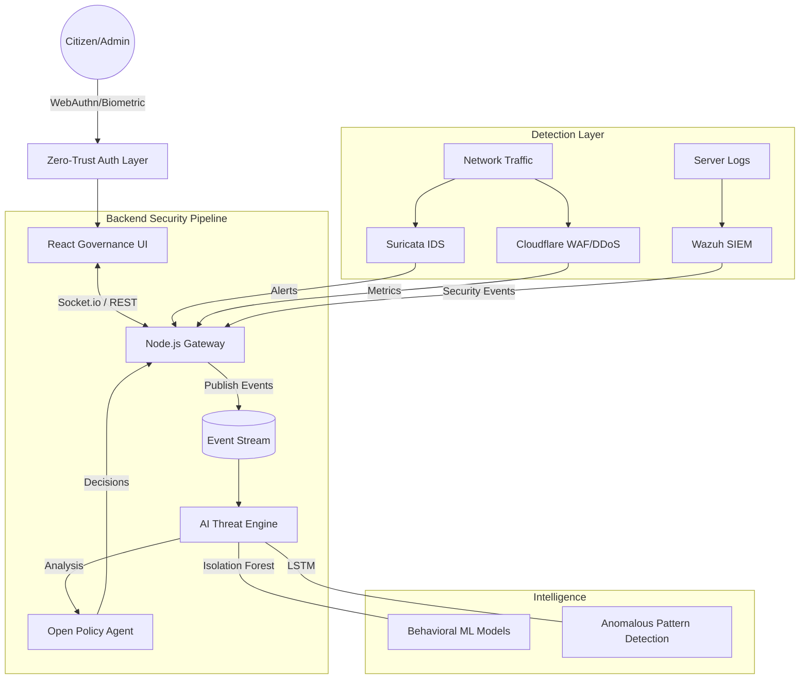

# SECURE SERVICE DELIVERY (SSD) 🛡️

### **End-to-End Secure E-Governance Delivery Platform**
*A high-performance, Zero-Trust security control center designed for modern GovTech infrastructure.*

---

## 🏗️ System Architecture



---

## ⚡ Key Features

*   **Passwordless Identity**: Biometric authentication via **WebAuthn (FIDO2)**. No passwords stored, only ECC public keys.
*   **Real-time Threat Monitoring**: Live dashboard for DDoS mitigation, SQL Injection blocks, and Port Scan detection.
*   **AI Risk Scoring**: Behavioral analysis using **Isolation Forest** and **LSTM** models to identify "Bot vs Human" traffic.
*   **OPA Policy Engine**: Centralized policy-as-code for citizen data access logs and transparency.
*   **High-Fidelity Simulation**: Built-in security simulator to demonstrate active defense against SQLi, XSS, and Bruteforce.

---

## 🛠️ Tech Stack

**Frontend:**
- **React 18** + **Vite**
- **TailwindCSS** (Modern Soft-Panel Styling)
- **Lucide React** (Iconography)
- **Motion (Framer)** (Micro-animations)
- **Socket.io-client** (Real-time updates)

**Backend:**
- **Node.js** (Express API Gateway)
- **SimpleWebAuthn** (Hardware-backed security)
- **Socket.io** (Bidirectional event streaming)

**Security AI Engine:**
- **Python 3.11**
- **Scikit-learn** (Isolation Forest)
- **FastAPI** (Machine Learning Service)

---

## 🚀 Getting Started

### 1. Prerequisites
- Node.js (v18+)
- Python (v3.9+)

### 2. Backend Setup
```bash
cd backend
npm install
node server.js
```

### 3. AI Engine Setup
```bash
cd backend/ai_engine
pip install -r requirements.txt
uvicorn main:app --port 8000
```

### 4. Frontend Setup
```bash
npm install
npm run dev
```

---

## 🔒 Security Compliance
- **Zero Trust**: Every request is verified via OPA and AI Risk Scoring.
- **Transparency**: Detailed "Citizen Data Access" logs with real-time risk flagging.
- **Privacy**: End-to-end encryption for all sensitive governance transmissions.

---
Created with ❤️ by SecureGov Engineering.