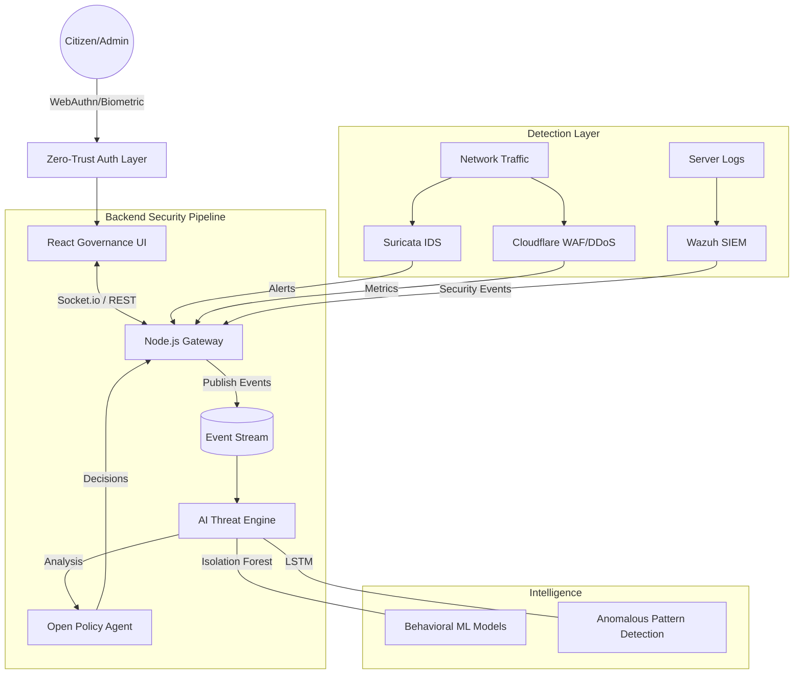

# SECURE SERVICE DELIVERY (SSD)

### **End-to-End Secure E-Governance Delivery Platform**
*A high-performance, Zero-Trust security control center designed for modern GovTech infrastructure.*

  

---

## 🏗️ System Architecture

---

## 🔒 Professional Service Architecture & Cyber Security Stack

### **1. CORE PLATFORM SERVICES**

| Layer | Technology | Role |
| :--- | :--- | :--- |
| **Frontend UI** | React 18 / Vite 6 / Tailwind | Premium Soft-Panel Dashboard with Real-time WebSockets |
| **Backend API Gateway** | Node.js (Express) | High-concurrency event handling and API orchestration |
| **Real-time Stream** | Kafka / Socket.io | Bi-directional lightning-fast data pipeline for security alerts |
| **Intelligence Engine** | Python (FastAPI) | Machine Learning service for live behavioral anomaly detection |

### **2. CYBER SECURITY INFRASTRUCTURE**

| Service | Category | Implementation Details |
| :--- | :--- | :--- |
| **Cloudflare WAF** | Edge Security | L7 Anti-DDoS, Bot Management, and CDN-level protection |
| **SimpleWebAuthn** | Identity Layer | Passwordless biometric authentication using ECC Private keys |
| **Suricata IDS** | Network Detection | Deep Packet Inspection (DPI) to block SQLi, XSS, and Scans |
| **Wazuh SIEM** | Log Analysis | Endpoint monitoring and aggregate threat visibility across servers |
| **CrowdSec IPS** | Active Defense | Reputation-based blocking of malicious IPs in real-time |
| **Open Policy Agent (OPA)** | Policy Engine | Centralized Policy-as-Code for citizen data access control |

### **3. AI THREAT MODELS**

*   **Isolation Forest**: Used for identifying outlier behavior in citizen traffic patterns.
*   **LSTM Neural Networks**: Predicts potential attack sequences based on temporal behavior analysis.
*   **Behavioral Risk Scoring**: Dynamically calculates a "Citizen Risk Score" for every data access request.

---

## Key Features

*   **Zero-Trust Identity Monitoring**: Biometric authentication via **WebAuthn (FIDO2)**.
*   **E-Governance Transparency**: Detailed citizen data access logs with automated risk auditing.
*   **Unified Security Dashboard**: Real-time visibility into global DDoS, WAF, and IDS events.
*   **Automated Policy Evaluation**: Instant OPA-driven decisions for sensitive record access.

---

## Security Compliance

- **Zero Trust Architecture**: Every request is verified via OPA and AI Risk Scoring.
- **Data Transparency**: Detailed citizen data access logs with real-time risk flagging.
- **Privacy First**: End-to-end encryption for all sensitive governance transmissions.

---
Developed by SecureGov Engineering Team.